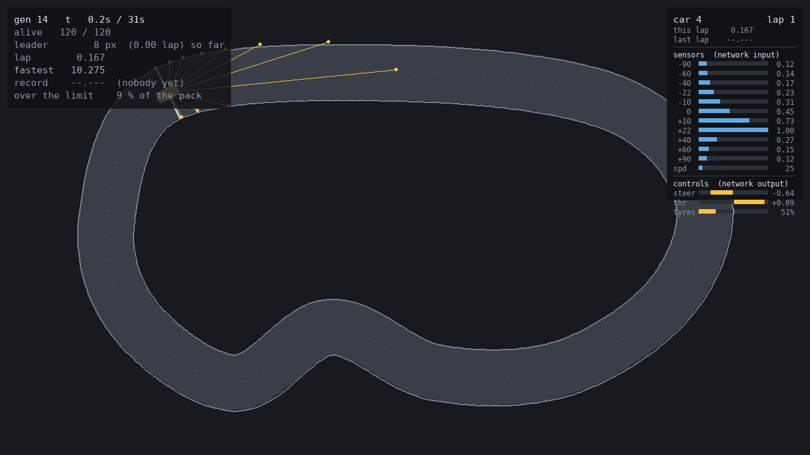
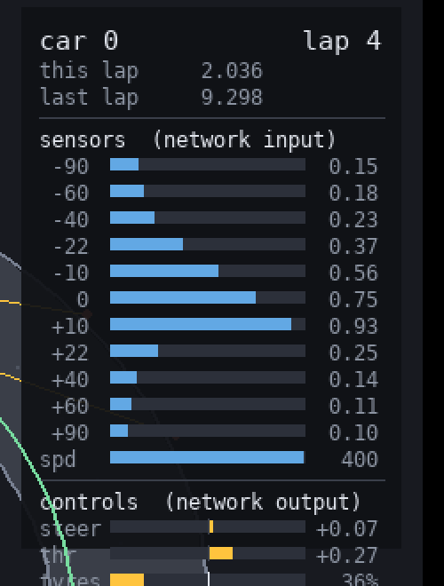
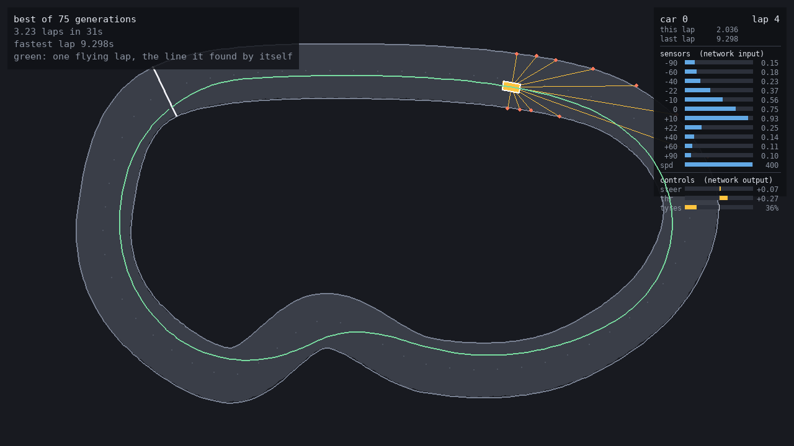
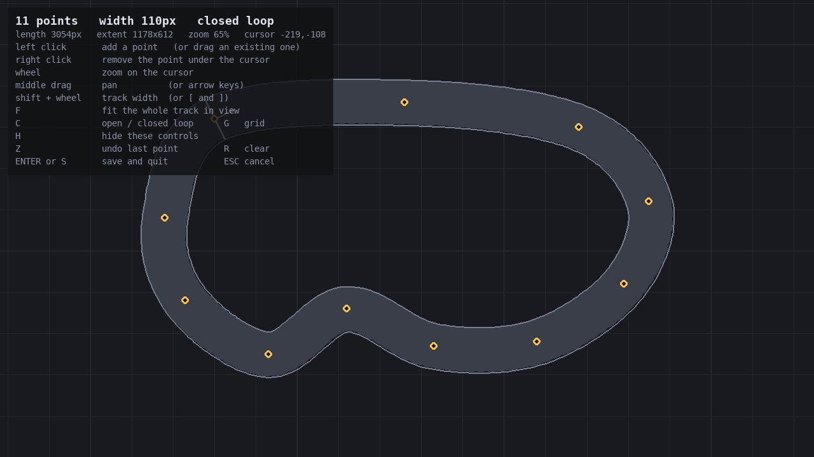

# cars_NEAT

Cars that teach themselves to drive a circuit, with **NEAT implemented from
scratch** — no `neat-python`, no ML framework. Only `numpy` and `pygame`.




*Generation 14 on `grand_prix`: 120 cars, most of them a fresh mutation that will
not survive the first corner. The leader is highlighted with its sensor rays, and
the panel on the right is the exact conversation between the track and the
network driving that car.*

```
python main.py train --track grand_prix     # evolve a population, watch it live
python main.py watch                        # replay the best driver
python main.py edit  -o tracks/mine.json    # draw your own circuit
python main.py play  --track curvy          # drive it yourself
python main.py tracks                       # circuits, and the fastest lap on each
```

## Setup

```bash
python3 -m venv .venv
.venv/bin/pip install -r requirements.txt
.venv/bin/python main.py train
```

## What the cars see and do

Each car has **11 distance sensors**, bunched towards the front
(−90, −60, −40, −22, −10, 0, +10, +22, +40, +60, +90 degrees), plus its own speed
— 12 inputs, all normalised to roughly [0, 1] so nothing saturates the `tanh`
units. The network returns **2 continuous outputs**: steering and throttle, both
in [−1, 1].

The fan is deliberately uneven. The braking decision hangs on what is straight
ahead, and an evenly spread fan gives that the same single number as the view out
of the side window. Bunching the rays forward is worth 5.5% of lap time — more
than doubling the population, and cheaper.



### The tyres are the hard part

Turning and accelerating draw on **one grip budget**. Cornering demands `v²/R`,
so the fastest a car can take a corner is `sqrt(grip · R)` — 140 px/s in the
tightest corner of `grand_prix`, against a 400 px/s top speed. Ask for more than
the tyres have and the car does not obey and stop: it turns *less* than asked and
runs wide. That is understeer, and it ends in the wall.

Because the two demands share a budget, braking into a corner costs grip that is
then missing to turn with, so the driver has to be done braking before it starts
turning hard.

Braking gets its own, larger budget: under braking the mass pitches forward and
loads the front tyres, so a car stops harder than it corners. Keeping the two
separate is also what lets the brakes be strengthened without handing the
cornering back the grip that was taken away from it.

Top speed is bounded by what the car can still brake for. Hauling 400 down to
140 px/s takes 284 px, against a 450 px sensor range — much faster and the corner
would arrive before the car could see it, which is not a harder problem, just an
unfair one. Grip and sensor range are one decision, not two.

This is the difference between a driving problem and a steering problem. Without
it the throttle output was pinned at +1.00 for 100% of a lap — there was never a
reason to lift, and the network only ever learned to steer. A trained driver now
brakes for 21% of a lap and lifts off for 39% of it.

Whether a circuit really *needs* the brakes is not something one hand-written
driver can settle — a naive controller crashes because it steers badly, and an
evolved one finds smooth wide lines a naive one never would. So
`tools/flat_out_check.py` evolves the steering itself, twice: once with the
throttle nailed to +1, once with it free.

The test suite checks the same property the cheap way, with the hand-written
reference pilot of `sim/pilot.py`, which is deterministic and runs in a second:

| | flat out | braking |
|---|---|---|
| oval | 0.49 laps, crashes at 4.3s | 2.84 laps, brakes 20% of the time |
| curvy | 0.46 laps, crashes at 4.4s | 2.26 laps, brakes 19% |
| grand_prix | 0.36 laps, crashes at 4.2s | 2.58 laps, brakes 20% |
| snake | 0.23 laps, crashes at 2.4s | **finishes** |
| endurance | 0.09 laps, crashes at 4.2s | 3.05 laps, brakes 19% |

Both halves matter: no circuit can be driven without braking, and every one of
them is comfortably drivable with it. It is easy to make a track that simply
cannot be driven.

Fitness is **how far along the lap the car got before the clock ran out**, plus
**the seconds its quickest lap came in under par** — par being the lap a 250 px/s
cruise would do, and a second worth 180 points (`--lap-bonus 0` turns it off).

The distance term is what makes the signal usable at all: it is dense (every
frame moves it), it has no ceiling (going faster always scores more), and it
cannot be gamed by sitting still. What it cannot do is separate two cars that
covered the same ground, one of them stringing together clean quick laps and the
other scrabbling round barely under control — and only the first is going
anywhere. The pace term separates them. It pays nothing for a lap slower than
par, so a population that is still learning to stay on the road is ranked on
distance alone and only starts being judged on pace once it has some.

Cars are retired when a corner of the body leaves the tarmac, or after 2.5 s
without progress.

The clock is derived from the track rather than fixed: a generation lasts long
enough for about 2.5 laps at cruising speed, so a 3 000 px circuit gets 31 s and
a 12 400 px one gets 124 s. A fixed 30 s would be three laps of the first and
barely one of the second, which leaves a big map almost no room to tell a good
driver from a lucky one. Override with `--time`, or retarget with `--laps`.

Training only saves over an existing model when the new run actually beats it,
so a quick experiment cannot destroy the result of a long one (`--overwrite` to
force it).

## The stopwatch

Every car carries its own clock, started at the line and stopped each time it
runs over it again, so a run reads like a timing screen rather than a distance
counter:

```
lap       12.482            the lap in progress, for the car in front
fastest    8.754  -0.412    the quickest of this session, and its gap to the record
record     9.166  ai gen 176
```

The record outlives the run that set it. It lives in `models/records.json`, and
`python main.py tracks` is then the answer to "how fast has anything ever gone
round here":

```
  circuit         length  fastest
  curvy          2435 px  lap   --.---  (nobody yet)
  grand_prix     3062 px  lap    8.754  ai gen 176
  oval           2304 px  lap    7.157  ai gen 6
  snake          1765 px  run   --.---  (nobody yet)
```

A time is only a record while the question it answers is the same one, so each
entry carries a fingerprint of the circuit *and* of the car's handling. Redraw
the track or change the physics and the old time is retired rather than quietly
compared against a different problem. `--forget NAME` drops one by hand.

Timing has to be finer than the frame it happens on. Rounding a crossing to the
step it was noticed on costs a whole step — 33 ms at 30 Hz, more than the gap
between two genuinely different drivers, and enough to move every lap time when
the step size changes. The lap-progress grid is no better: it only knows where a
car is to the nearest 8 px sample. So the instant is read off the car itself —
how far past the start plane it sits, over how fast it is going through it —
and both ends of a lap are timed the same way, so what the sampling does to one
cancels in the difference. The same lap then comes out within a few milliseconds
at 30 Hz and at 120 Hz.

Driving it yourself is timed by the same clock and goes in the same book, under
`you` rather than `ai`. An evolved driver laps `grand_prix` in 8.754; the
hand-written reference pilot, which reads the geometry directly and computes a
proper braking profile from it, manages 10.727.

## How the NEAT part works

`neatlite/` is a small, readable implementation of Stanley & Miikkulainen's
algorithm. The three pieces that make it more than a genetic algorithm bolted
onto a neural net:

| file | what it holds |
|---|---|
| `neatlite/genome.py` | node/connection genes, **innovation numbers**, the five mutations (weight, bias, add-node, add-connection, delete), crossover, and the compatibility distance |
| `neatlite/network.py` | compiles a genome into a topologically sorted feed-forward net |
| `neatlite/population.py` | **speciation**, **fitness sharing**, stagnation, and the reproduction loop |
| `neatlite/config.py` | every knob, in one dataclass |

Populations start **minimal** — inputs wired straight to outputs, no hidden
layer — and grow structure only when a mutation earns it. A typical winner on
`grand_prix` ends up with 3 hidden nodes, covers 3.2 laps in its 31 seconds with
a 9.3s best lap, and beats `sim/pilot.py` — the hand-written pure-pursuit driver
that reads the track geometry directly and computes a proper braking profile from
it.



Nobody told it about racing lines. Left to a fitness that only counts ground
covered, it widens the tightest corner from a 66 px centre-line radius to a 245 px
arc — and its lap beats a classical minimum-curvature racing line by 5%.

Innovation numbers let two genomes with different topologies be lined up gene by
gene during crossover. Speciation means a freshly mutated topology competes
against its own kind for a few generations instead of being wiped out before its
weights are tuned. Fitness sharing stops one lucky species from eating the pool.

## How the track works

A track is a **centre line plus a width**, stored as a few control points in a
JSON file. The curve through them is smoothed (Catmull-Rom) and resampled every
8 px, then baked once into two grids:

- `on_track` — boolean, "is this cell drivable" → collision is one array lookup
- `progress` — float, "how far along the lap is this cell" → fitness is one array lookup

Both are built by having each centre-line sample stamp a disc into its own
neighbourhood, keeping whichever sample turned out to be closest. That is linear
in the length of the track, so a map ten times bigger costs ten times more rather
than a hundred: a 10 000 px circuit bakes in 0.06 s.



One rule matters when drawing your own: **no corner may be tighter than half the
track width**. Past that the two walls fold back through the tarmac and silently
open a shortcut. The editor draws those corners in red and says so, and the test
suite asserts the built-in tracks are clean.

Sensors are cast by marching all rays of all cars at once on the occupancy grid
and bisecting around the first hit, so the cost does not depend on how
complicated the circuit is. The whole fleet lives in shared numpy arrays: one
simulation step for 120 cars takes about 5.9 ms, of which the rays are roughly
95%.

## Tests

```bash
.venv/bin/python tests/test_neat.py      # or: .venv/bin/python -m pytest tests -q
```

Covers the XOR benchmark (the classic proof that a NEAT implementation really
does grow the hidden node it needs), an invariant that mutation never creates a
cycle, genome serialisation round-trips, track geometry and sensor sanity, that
the tyres really do cap what the driver asks for, that every circuit needs the
brakes *and* is drivable with them, that the lap clock agrees with the ground
covered and does not depend on the simulation step, that shuffling backwards over
the line cannot invent a lap record, and a short training run that has to clearly
beat generation zero.

## Controls

**Editor** — the canvas is unbounded, the window is just a viewport onto it.

| | |
|---|---|
| left click | add a point, or drag an existing one |
| right click | remove the point under the cursor |
| wheel | zoom on the cursor |
| middle drag / arrows | pan |
| shift + wheel, `[` `]` | track width |
| `F` / `G` / `H` | fit the track in view / grid / hide the controls |
| `C` / `Z` / `R` | open-closed loop / undo / clear |
| `ENTER` or `S` / `ESC` | save and quit / cancel |

**Training and replay window** — `H` hide the view and train at full speed,
`SPACE` skip the current generation, `+`/`-` simulation steps per frame, wheel to
zoom, drag to pan, `F` to fit, `L` to lock the camera on the leading car, `ESC`
to stop and save. Both windows are resizable.

**Manual drive** — arrows or WASD, `R` restart, `ESC` to quit. `L` follows the
car: on a circuit that fits on screen that only centres it, on one that does not
(endurance is 4500px across) it zooms to a chase camera keeping about a second
of road ahead, and `F` hands the whole circuit back. Your laps are timed against
the same record as the cars'.

## Layout

```
main.py                 CLI: train / watch / edit / play / tracks
neatlite/               the NEAT algorithm, dependency-free
sim/  track.py          geometry, collision grid, raycasting
      car.py            vectorised fleet physics and sensors
      evolve.py         fitness evaluation for one generation
      records.py        lap times, and the fastest ever on each circuit
      render.py         pygame view
      editor.py         mouse-driven track editor
      pilot.py          hand-written reference driver, used as a yardstick
      builtin_tracks.py oval, curvy, grand_prix, snake, endurance
tools/  flat_out_check.py  proves a circuit cannot be driven without braking
tracks/  *.json         circuits
models/  *.json         saved genomes
assets/                 sprites from the first version, kept for reference
```
